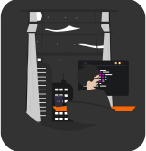

### Olá! 

Seja bem vindo!

    
    
Me chamo Paulo, tenho 27 anos e sou estudante de analise e desenvolvimento de sistemas.

    
Gosto de me dedicar bastante a linguagem python,  mas procuro separar um tempo para me dedicar a outras liguagens tambem.

  <a href="https://github.com/paulosergiocf">
  
  

 
  
  
  
  
  
 

